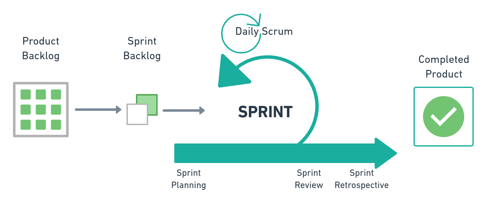

**Table of Contents**

- [LEAN UX](#lean-ux)
  - [Based on](#based-on)
    - [Design Thinking](#design-thinking)
    - [Agile Methodology](#agile-methodology)
    - [Lean Startup](#lean-startup)
  - [LEAN UX Principles](#lean-ux-principles)
  - [Interesting books](#interesting-books)
  - [Interesting links](#interesting-links)
  - [Lean UX checklist](#lean-ux-checklist)
  - [Other repositories](#other-repositories)
  - [Reference](#reference)

# LEAN UX

Lean UX is agile teams focused on User Experience.

## Based on

Lean UX is based on **Design Thinking**, **Agile Methodology**, and **Lean Startup**.  

### Design Thinking

Design Thinking seeks to see everything through the **user's eyes**

> Read more in [Design Thinking](https://www.interaction-design.org/literature/topics/design-thinking).

### Agile Methodology

Agile Methodology allows you **to create things continuously** and establish an improvement process each time a product is delivered.

> Read more in [Agile & Scrum Methodology](https://medium.com/technology-nineleaps/agile-scrum-methodology-300f43ee6f3e).

### Lean Startup

Lean Startup seeks to **bring ideas** as soon as possible to the market to obtain feedback and work in the continuous improvement of the product.

> Read more in [Lean Startup as a Core Strategy: Short Review & Tips](https://medium.com/@sumatosoft/lean-startup-as-a-core-strategy-short-review-tips-136e4ec529f4).

## LEAN UX Principles

LEAN UX principles help us establish a new work culture for ourselves.

1. Multidisciplinary teams: It is essential to work with people who can work well in all areas of development.
2. Small, dedicated, and united groups: It needs to be a small team to ensure control, in which everyone knows each other.
3. Progress: It needs to be worked on in terms of value, not functionalities or products.
4. Problem-focused teams: It can not focus on features, but rather on problems to be solved.
5. Remove the waste: Whatever is not useful, do not build; do not spend money on anything.
6. Small deliveries: It needs to be little to have more feedbacks, as soon as possible, to fail fast, but to succeed quickly.
7. Continuous delivery: The user should be seeing what is being built on knowing that it will be useful.
8. Goob (Get Out Of the Building): You need to know the world through the user's eyes.
9. Shared knowledge: The team needs to understand the problem they are attacking and have the same view of the product.
10. Leveled times: Do not have any stars on the team. If the group is level, it advances along.
11. Try to outsource your work: It is good to have an environment that values innovation and promote a collaborative environment.
12. Making over-analyzing: Try to create more than explain. Try to get feedback as soon as possible.
13. Learn before climbing: Instead of creating a giant product, first, learn with the user.
14. Permission to fail: You should create an environment conducive to testing, not an environment conducive to negligence failures.
15. Quit the business of deliverables: Documents are essential for understanding decisions, but the team should focus on functionalities.

> Read more in [The 3 foundations of Lean UX](https://www.oreilly.com/content/the-3-foundations-of-lean-ux/).

## Interesting books

* [Design Thinking: Integrating Innovation, Customer Experience, and Brand Value, de Thomas Lockwood](https://www.amazon.com/Design-Thinking-Integrating-Innovation-Experience/dp/1581156685)
* [Scrum: The Art of Doing Twice the Work in Half the Time](https://www.amazon.com/Scrum-Doing-Twice-Work-Half/dp/038534645X)
* [The Lean Startup: How Today's Entrepreneurs Use Continuous Innovation to Create Radically Successful Businesses](https://www.amazon.com/Lean-Startup-Entrepreneurs-Continuous-Innovation/dp/0307887898)

## Interesting links

* [The Most Complete Design Thinking Tools & Resource Collections](https://www.mockplus.com/blog/post/design-thinking-tools)
* [Principles behind the Agile Manifesto](http://agilemanifesto.org/principles.html)
* [“The Lean Startup” Summary and Review](https://medium.com/west-stringfellow/the-lean-startup-summary-and-review-5054675ff095)
* [Complete Guide to Lean UX](https://www.justinmind.com/blog/complete-guide-to-lean-ux/)
* [Lean UX: definition, process, and a detailed case study](https://www.hotjar.com/blog/lean-ux/)
* [The Beginner’s Guide to Lean UX](https://www.springboard.com/blog/beginners-guide-to-lean-ux/)
* [The Lean UX Manifesto: Principle-Driven Design](https://www.smashingmagazine.com/2014/01/lean-ux-manifesto-principle-driven-design/#top)

## Lean UX checklist

* [Design Thinking Questions Checklist](https://static1.squarespace.com/static/5afaca8c1aef1d704a6eaace/t/5b6fd5a44d7a9c3255891749/1534055845039/Design+Thinking+Questions+handout.pdf)
* [Scrum Checklist](https://www.crisp.se/gratis-material-och-guider/scrum-checklist)
* [Scrum Checklist - the unofficial](https://www.crisp.se/wp-content/uploads/2012/05/Scrum-checklist.pdf)
* [Lean Start Up Checklist](http://shb.export-entreprises.com/ressources/features/lean-startup-strategy.pdf)
* [The Lean Startup Methodology](http://theleanstartup.com/principles)

## Other repositories

* [UX Tools](https://github.com/mafda/ux_tools)
* [Design Sprint](https://github.com/mafda/ux_design_sprint)

## Reference

* [UX & Design Thinking: Experiência do Usuário nos negócios](https://www.udemy.com/course/ux-design/)
* [UX — LEAN UX](https://medium.com/@mafda_/ux-lean-ux-30ae46132a14)
* [Flowchart](https://whimsical.com/)

---
made with 💙 by [mafda](https://mafda.github.io/)